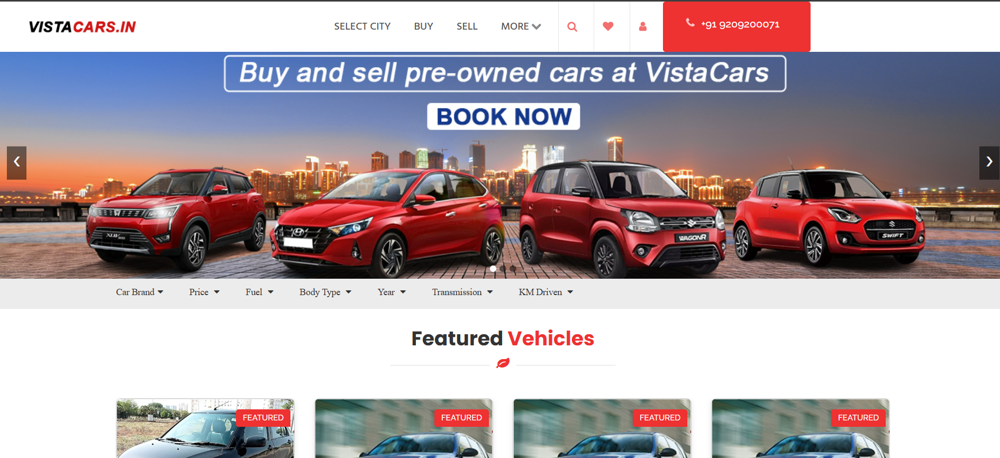
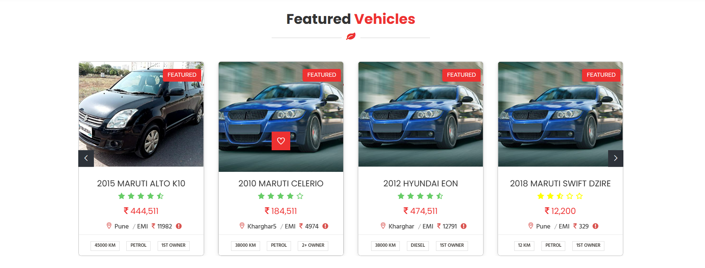
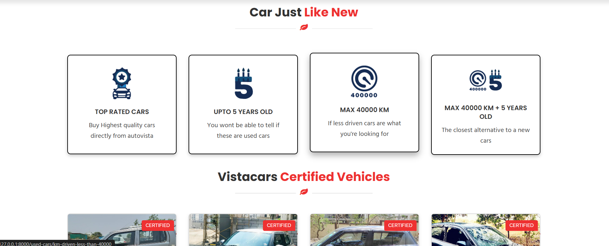
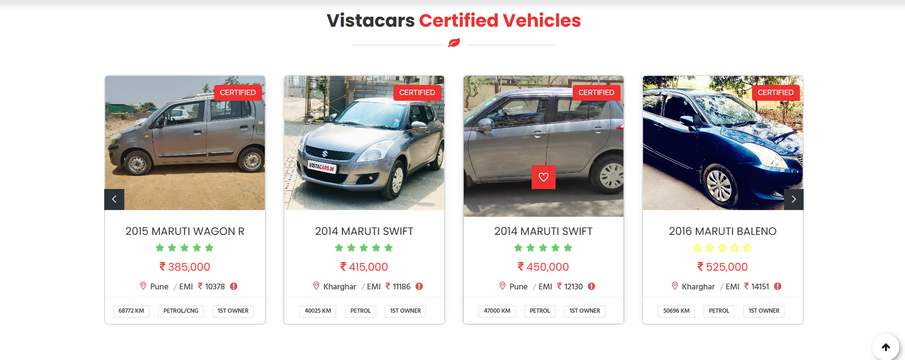
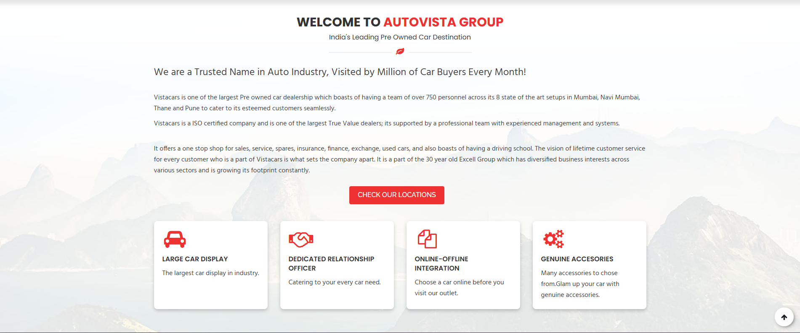
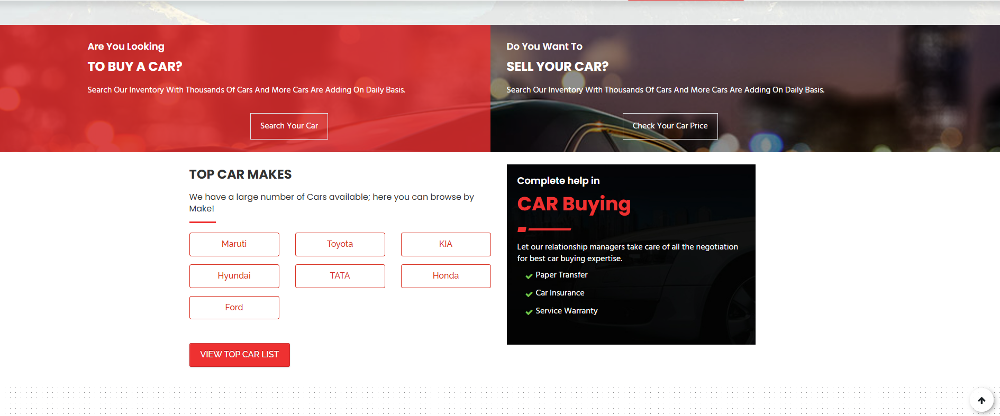
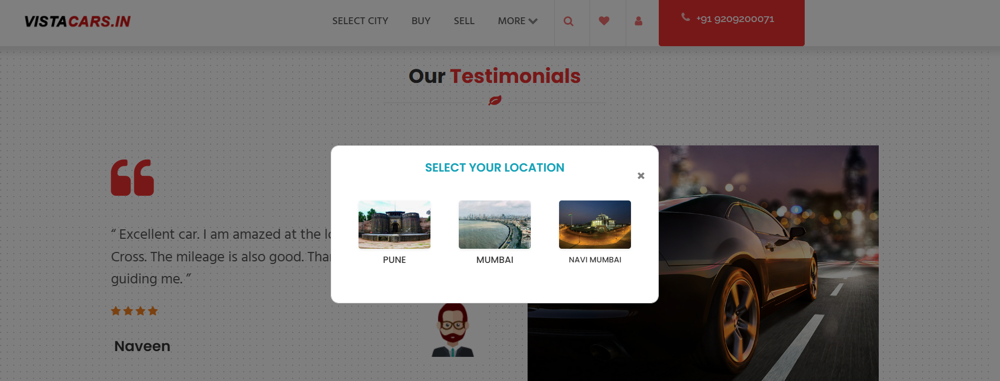
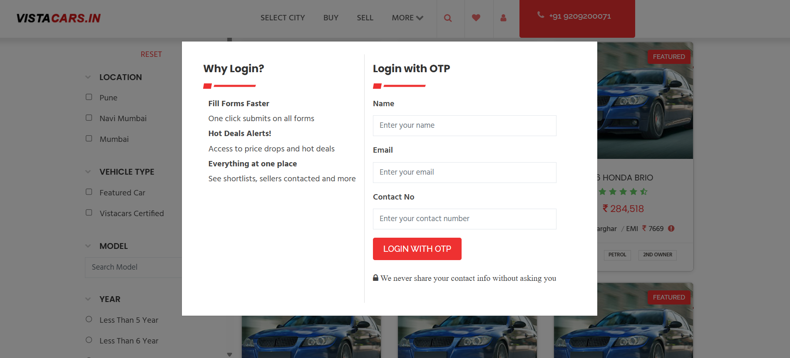

# 🚗 VistaCars - Pre-Owned Car Marketplace

## 📖 Overview

VistaCars is a **location-based pre-owned car marketplace** developed for **True Value dealerships**, enabling customers to search, compare, and purchase certified used cars across multiple cities and showroom locations.

The platform provides an intuitive user experience with advanced search filters, location-wise inventory, featured vehicles, EMI information, OTP-based authentication, and certified vehicle listings.

---

## ✨ Features

### 🔍 Advanced Vehicle Search

* Search cars by Brand
* Filter by Price Range
* Fuel Type (Petrol, Diesel, CNG)
* Body Type (Hatchback, Sedan, SUV)
* Model Year
* Transmission (Manual / Automatic)
* KM Driven

---

### 📍 Location-Based Inventory

* City-wise vehicle listings
* Area-wise showroom inventory
* Multiple True Value showroom locations
* Dealer-specific vehicle availability

Supported Cities:

* Mumbai
* Navi Mumbai
* Pune

Showroom Areas:

* Kharghar
* Thane
* Chembur
* Bandra
* Baner
* Hadapsar
* Kharadi
* Magarpatta
* Ravet
* Jejuri
* Uruli Kanchan
* And more...

---

### 🚘 Featured Vehicles

Each vehicle includes:

* Model Name
* Manufacturing Year
* Price
* Location
* EMI
* Fuel Type
* KM Driven
* Ownership Details

---

### ✅ VistaCars Certified Vehicles

* Certified Pre-Owned Cars
* Quality Inspected Vehicles
* Trusted Dealer Listings

---

### 🚗 Car Just Like New

Special categories:

* Top Rated Cars
* Up to 5 Years Old
* Maximum 40,000 KM Driven
* Low Driven Premium Vehicles

---

### ❤️ User Features

* OTP Login
* User Registration
* Wishlist / Favourite Cars
* Contact Dealer
* Car Inquiry

---

### 💰 Finance Support

* EMI Estimation
* Vehicle Pricing
* Finance Partner Information

---

### 📚 Additional Modules

* Blog
* FAQs
* Contact Us
* Customer Testimonials
* Sell Your Car
* Partner Banks

---

## 🛠️ Tech Stack

### Frontend

* HTML5
* CSS3
* Bootstrap
* JavaScript
* jQuery
* AJAX

### Backend

* PHP
* CodeIgniter

### Database

* MySQL

---

## 🚀 Key Highlights

* Advanced Multi-Filter Car Search
* Location-Based Vehicle Listings
* Certified Used Car Marketplace
* Responsive User Interface
* OTP Authentication
* Wishlist Functionality
* Featured & Certified Vehicles
* EMI Information
* Dealer-Wise Inventory Management
* Mobile-Friendly Design

---

## 📸 Screenshots

> Add screenshots of the Home Page, Featured Vehicles, Search Filters, Certified Vehicles, and Login Page here.
## 📸 Screenshots

### 🏠 Home Page

---

### 🚗 Featured Vehicles

---

### ✨ Car Just Like New

---

### ✅ VistaCars Certified Vehicles

---

### 🏢 Welcome to AutoVista

---

### 🚙 Top Cars

---

### 🌍 Select City

---

### 🤝 Our Partners

---

### 🔐 Login with OTP

---

## 📌 Future Enhancements

* Online Car Booking
* Compare Multiple Cars
* AI-Based Vehicle Recommendations
* Online EMI Calculator
* Google Maps Integration
* Online Payment Gateway
* Live Inventory Management

---

## 👨‍💻 Developed By

**Chandrakant**

PHP Developer | Laravel | MySQL | JavaScript | Bootstrap
